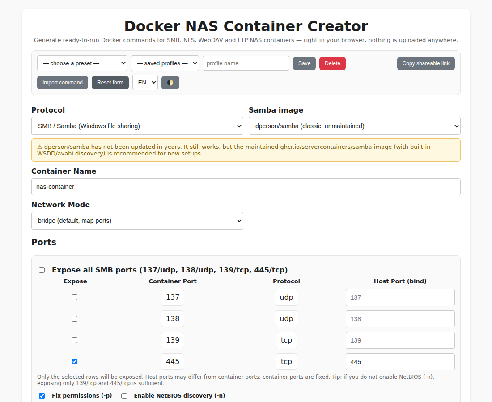
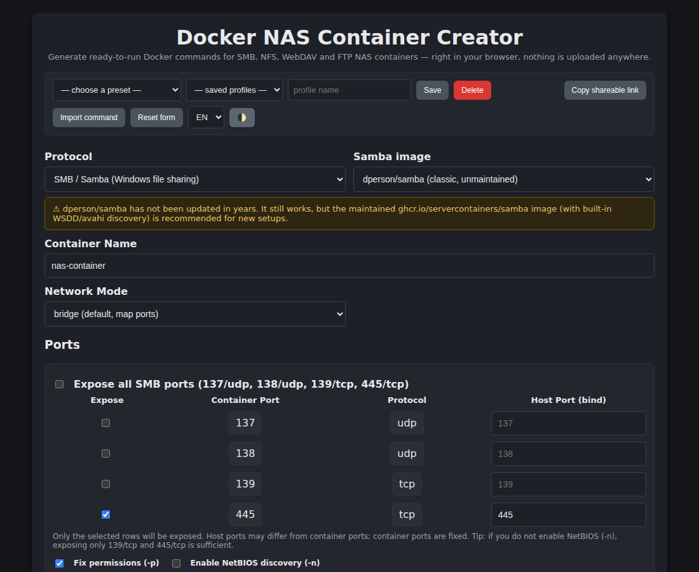

# Docker NAS Container Creator

[](https://github.com/dikeckaan/Docker-NAS-Container-Creator/actions/workflows/ci.yml)
[](https://github.com/dikeckaan/Docker-NAS-Container-Creator/actions/workflows/static.yml)
[](LICENSE)

**Live demo → https://dikeckaan.github.io/Docker-NAS-Container-Creator/**

A browser-based generator for NAS containers. Fill in a form, get a ready-to-run
`docker run` command, a `docker-compose.yml`, or a systemd unit — for SMB (Samba),
NFS, WebDAV or FTP. Everything runs client-side; nothing you type leaves the page.
It even works offline (installable as a PWA).

| Light | Dark |
| --- | --- |
|  |  |

## Features

- **Four protocols**: SMB/Samba (full support), plus basic NFS
  (`erichough/nfs-server`), WebDAV (`bytemark/webdav`) and FTP
  (`delfer/alpine-ftp-server`) generation.
- **Two Samba images**: the classic `dperson/samba` and the maintained
  `ghcr.io/servercontainers/samba` (env-var based config, built-in WSDD/avahi discovery).
- **Three output formats** in tabs: `docker run`, `docker compose`
  (paste-able into a Portainer stack, downloadable), and a systemd unit file.
- **Live preview** — the output updates as you type, with real validation:
  port ranges and collisions, duplicate share names, unknown users, unsafe
  characters, non-absolute paths, and proper shell escaping of every value.
- **Multiple shares & users** with per-share allowed users, read-only and guest
  flags; password generator, show/hide and strength hints.
- **Network modes**: bridge (port mapping grid), host (best for discovery),
  macvlan (own LAN IP).
- **Windows discovery**: NetBIOS toggle plus a WS-Discovery (wsdd) companion
  container option so shares appear in modern Windows Explorer.
- **Samba extras**: workgroup, timezone, permission fix, recycle-bin toggle,
  free-form global `smb.conf` options — including a Time Machine preset.
- **.env workflows**: reference an external `.env`, or build one in the page
  (sync from the form, apply back, validate for real, download).
- **Import**: paste an existing `dperson/samba` `docker run` command and the
  form fills itself.
- **Presets**: public guest share, family multi-user, read-only media,
  Time Machine target.
- **Profiles & sharing**: save named profiles in your browser, auto-restore the
  last session, or copy a shareable link (passwords are never included).
- **English/Turkish UI, dark mode, mobile layout, offline PWA.**

## Quick example

Selecting one share (`/srv/nas/media` → `media`, read-only, guest) produces:

```bash
docker run -d --name nas-container -p 445:445/tcp -v /srv/nas/media:/data0 \
  -e USERID=1000 -e GROUPID=1000 --restart unless-stopped dperson/samba \
  -p -s 'media;/data0;yes;yes;yes;all;none'
```

…or switch to the compose tab:

```yaml
services:
  nas-container:
    image: dperson/samba
    container_name: nas-container
    restart: unless-stopped
    ports:
      - '445:445/tcp'
    volumes:
      - '/srv/nas/media:/data0'
    environment:
      - USERID=1000
      - GROUPID=1000
    command:
      - -p
      - -s
      - 'media;/data0;yes;yes;yes;all;none'
```

## Security notes

- In "No .env" mode passwords are embedded in the command — they end up in your
  shell history and in `docker inspect`. The page warns you; prefer the `.env`
  modes for real deployments.
- `dperson/samba` has been unmaintained for years. It still works, but for new
  setups consider `ghcr.io/servercontainers/samba` (selectable in the form).

## Development

No build step. Clone, open `index.html`, done.

```bash
npm test                            # unit tests for the command builder (Node 20+)
npx --yes html-validate index.html  # HTML lint
```

See [CONTRIBUTING.md](CONTRIBUTING.md) for the project layout and guidelines,
and [IMPROVEMENTS.md](IMPROVEMENTS.md) for the roadmap. Licensed under the
[MIT License](LICENSE).

---

## Türkçe

Tarayıcıda çalışan bir NAS container komut üreticisi. Formu doldurun; SMB
(Samba), NFS, WebDAV veya FTP için çalışmaya hazır bir `docker run` komutu,
`docker-compose.yml` veya systemd unit dosyası alın. Her şey tarayıcınızda
çalışır, hiçbir veri gönderilmez; çevrimdışı da kullanılabilir (PWA).

**Canlı demo → https://dikeckaan.github.io/Docker-NAS-Container-Creator/**

Öne çıkanlar: canlı önizleme ve gerçek doğrulama, çoklu paylaşım/kullanıcı,
parola üretici, bridge/host/macvlan ağ modları, Windows keşfi (NetBIOS + wsdd),
Time Machine dahil hazır şablonlar, .env oluşturma/doğrulama, mevcut komutu içe
aktarma, profiller ve paylaşılabilir bağlantı, Türkçe/İngilizce arayüz ve
karanlık mod. Sağ üstteki **TR** seçeneği ile arayüzü Türkçeye çevirebilirsiniz.
